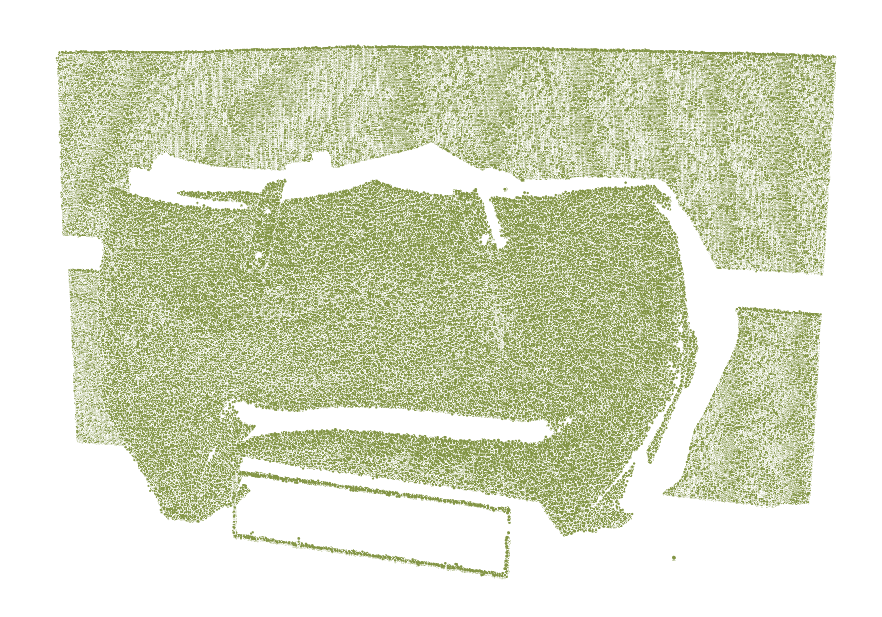

# Structured-light-stereo

This repo uses a stereo camera and gray-code-based structured light to realize dense 3D reconstruction. 

. 

### How to use:
* **STEP 0:** `pip install opencv-python==4.5.4.60 opencv-contrib-python==4.5.4.60` (Version is necessary since the APIs are changed in higher versions.)

* **STEP 1:** Setup the stereo camera and calibrate it with a Charuco board. An example dataset is provided in `./data/stereo_calib_flir`. You can play with it by running `./capture/charuco_calib.py`. The calibration results will be saved in '`./data/stereo_calib_flir/stereo_calib_data.h5`.
* **STEP 2:** Connect your projector with your computer and run `gray_code_encoder.py` to project gray-code patterns. I used two FLIR cameras to build my stereo system and the driver script is `./capture_calib/double_flir_capture.py`. An example dataset is in `./data/bag`.
* **STEP 3:** Run one of the three `gray_code_decoder_*.py` scripts to get the reconstructed point clouds. Differences among them are:
    * `gray_code_decoder_disp.py`: First recover a disparity map and rely on it to construct the point clouds. So the matching is column-direction only. This script can be the primary choice with good stereo calibration.
    * `gray_code_decoder_tria_all_pts.py`: First respectively construct the pixel-level camera-projector correspondences. Then triangulate the left-right camera pixels that correspond to the same projector's pixel. So the matching is 2D.
    * `gray_code_decoder_tria_unique_pts.py`: Same as above. But only pixels with unique correspondences are triangulated.
    
    
    
